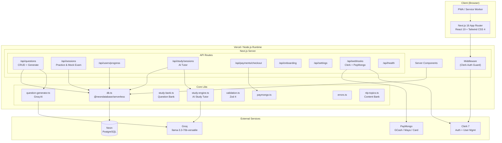
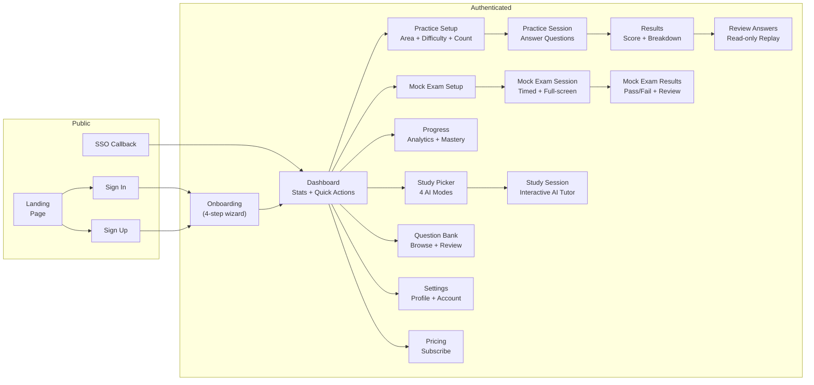
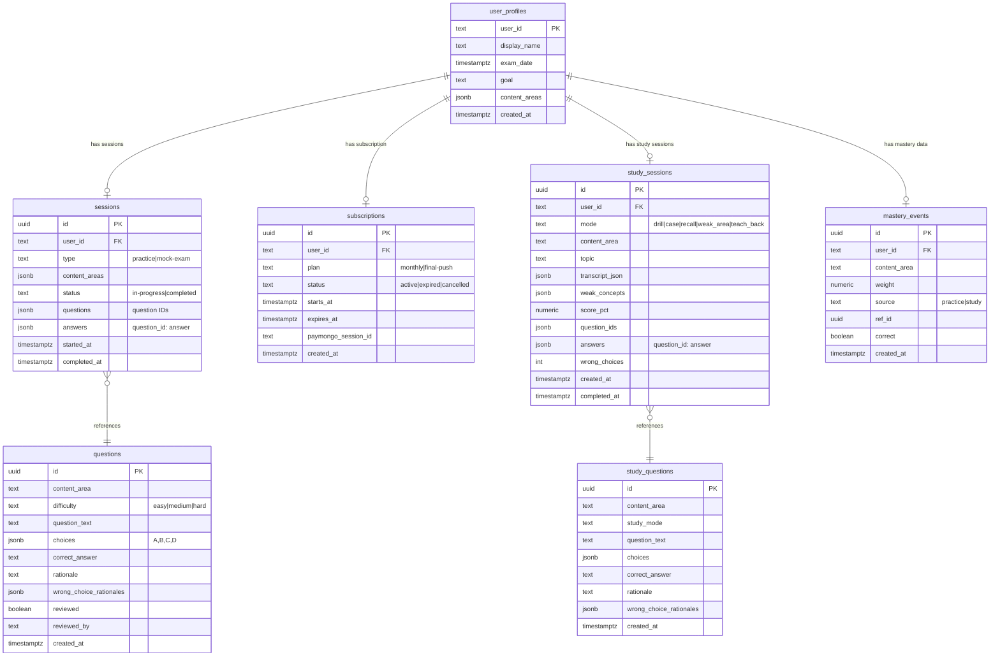
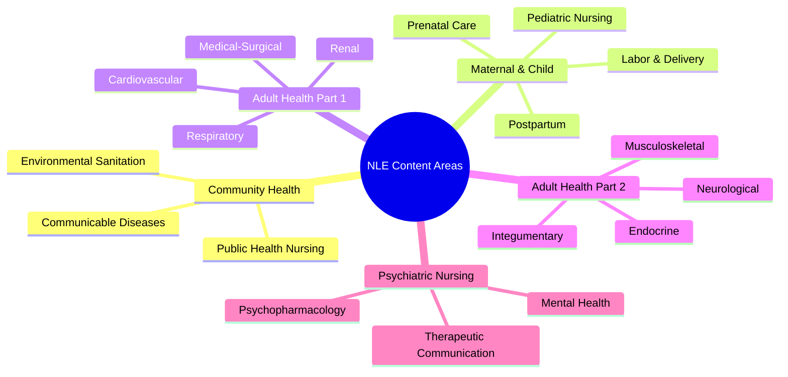
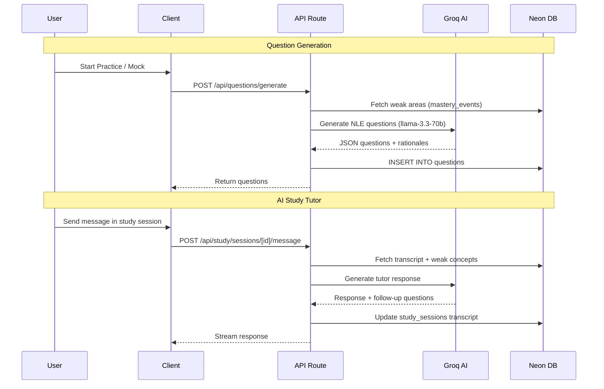
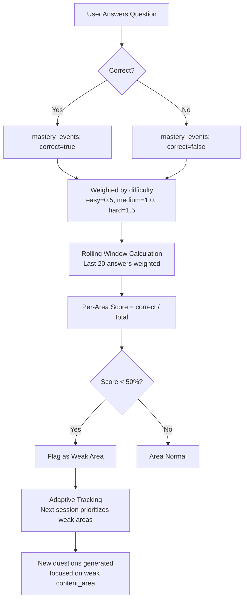
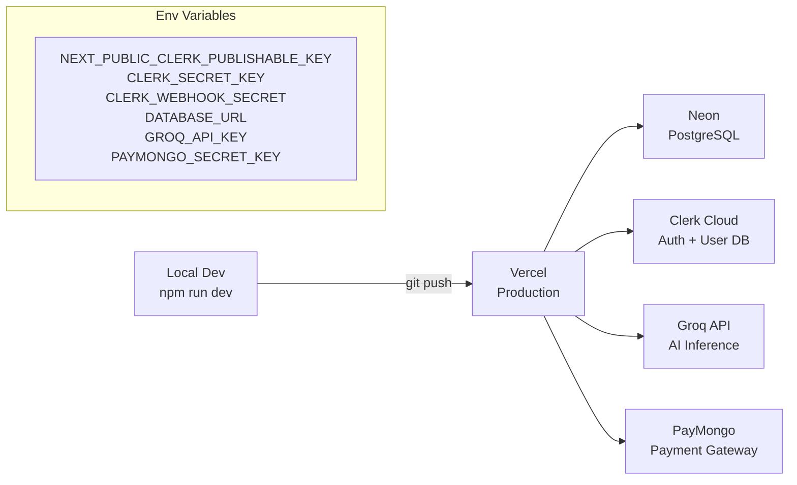

# Boards — System Design

> AI-powered NLE review platform. Full architecture as of current codebase.

---

## High-Level Architecture

---

## Frontend Pages & Navigation

---

## Database Schema

---

## Feature Matrix

| Feature | Component | API Route | DB Table | External |
|---------|-----------|-----------|----------|----------|
| Auth (Email/Google/SSO) | sign-in, sign-up, sso-callback | — | — | Clerk |
| Onboarding | onboarding/ (4-step) | GET/POST /api/onboarding | user_profiles | — |
| Dashboard | dashboard/ | — | — | — |
| Practice Mode | practice/ | POST /api/sessions | sessions, questions | — |
| Mock Exam | mock-exam/ | POST /api/sessions | sessions, questions | — |
| Question Generation | — | POST /api/questions/generate | questions | Groq AI |
| Question Review | question-bank/ | POST /api/questions/review | questions | — |
| Progress Analytics | progress/ | GET /api/users/progress | mastery_events, sessions | — |
| Adaptive Tracking | — | (auto in /api/sessions) | mastery_events | — |
| AI Study Tutor | study/ | POST /api/study/sessions/[id]/message | study_sessions, study_questions | Groq AI |
| Study Question Bank | — | POST /api/study/sessions | study_questions | — |
| Pomodoro Timer | components/pomodoro-modal | — | — | — |
| Subscription Payment | pricing/ | POST /api/payments/checkout | subscriptions | PayMongo |
| Webhooks | — | POST /api/webhooks/* | — | Clerk, PayMongo |
| Settings | dashboard/settings/ | GET/PATCH/DELETE /api/settings | user_profiles | — |
| PWA | manifest, sw-register | — | — | — |

---

## Content Areas (NLE Table of Specifications)

---

## AI Integration Flow

---

## Mastery Scoring System

---

## Study Modes

| Mode | Description | DB Value |
|------|-------------|----------|
| Concept Drill | Q&A flashcard style with immediate feedback | `drill` |
| Case Walkthrough | Clinical scenario with step-by-step analysis | `case` |
| Rapid Recall | Speed round, timed questions | `recall` |
| Teach-It-Back | Student explains concept back to AI | `teach_back` |
| Weak Area | Auto-selected based on mastery tracking | `weak_area` |

---

## Deployment & Infrastructure

